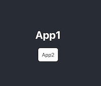

# cra2cra

Use local/production Create React App in another local/production Create React App

[](#readme)

## Install

```shell
npm i
```

## Launch locally

### With VS Code Tasks

```text
[CMD]+[Shift]+[P]
>Tasks: Run Task
Run apps
```

### In terminal

```shell
npm start
```
